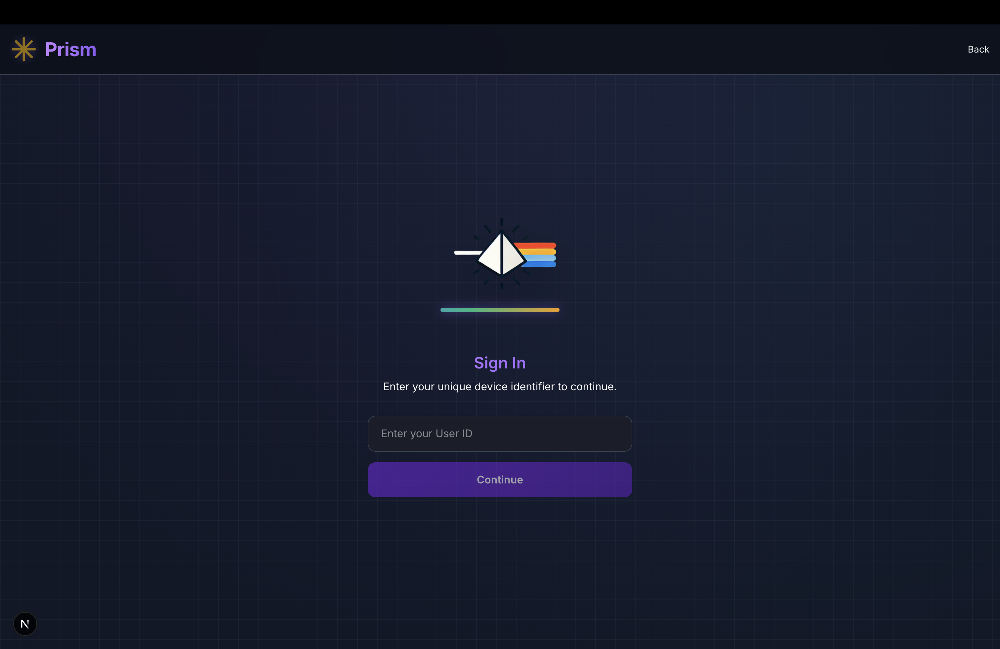

# Project Overview

Prism LED transforms ordinary LED strips into adaptive smart lighting through an Arduino controller. Users simply describe their situation in natural language, and our system automatically selects optimal lighting while learning preferences over time. 

This affordable, eco-friendly solution requires no LED replacement, making premium lighting experiences accessible to everyone through a simple plug-and-play setup and flexible subscription options. Designed primarily for budget-conscious students and young adults, Prism represents the future of personalized, intelligent lighting.


This repository contains the Infrastructure as Code (IaC) for an AI-powered LED control system using AWS services and Terraform. The system processes audio and pattern inputs through Google's Gemini AI to generate personalized lighting configurations, which are then sent to IoT devices.

## Project Repositories

- **Backend**: [AI_LED_Backend](https://github.com/sunhokim/AI_LED_Backend) (this repository)
- **Frontend**: [AI_LED_Frontend](https://github.com/TaemnLee/AI_LED_Frontend)
- **Project Canvas**: [Lean Canvas](https://sunhome243.github.io/leancanvas/) - Learn more about the project vision, target customers, and business model

## Tech Stack


## System Architecture

The AI LED system provides a novel approach to personalized lighting through AI-driven analysis. It uses:

1. **Google Gemini AI** for analyzing user audio and patterns
2. **AWS Lambda** for serverless processing
3. **DynamoDB** for data persistence
4. **AWS API Gateway** for REST and WebSocket APIs
5. **S3** for storage
6. **IoT Devices** for light control via IR codes

### 1. Home Page


### 2. UUID Input Page



### 3. PIN Input Page


### 4. Recording Page


### Architecture Diagram


### Data Flow Diagram


## Components

### API Gateway

- REST API endpoints for audio and pattern processing
- WebSocket API for real-time communication with LED controllers

### Lambda Functions

- `audio_to_ai`: Processes audio files and sends them to Gemini AI for emotion analysis
- `pattern_to_ai`: Processes pattern data for AI-based lighting suggestions using "surprise me" functionality
- `result_save_send`: Saves AI results to DynamoDB and S3, and sends commands to devices via WebSocket
- `connection_manager`: Manages WebSocket connections between backend and IoT devices

### DynamoDB Tables

- `AuthTable`: User authentication with UUID and PIN
- `IrCodeTable`: Stores IR codes for controlling LED devices
- `ResponseTable`: Records AI responses and user interactions
- `ConnectionIdTable`: Maps UUIDs to WebSocket connection IDs

### S3 Buckets

- Storage for response data and analysis results

## Lighting Settings

The system supports two modes of operation:

1. **RGB Color Mode**: Specific RGB values [R, G, B] for static lighting
2. **Dynamic Mode**: Pre-programmed lighting effects including:
   - FLASH, STROBE, FADE, SMOOTH
   - JUMP3, JUMP7, FADE3, FADE7
   - MUSIC1, MUSIC2, MUSIC3, MUSIC4

The AI selects the appropriate mode based on context, audio content, or user patterns.

## API Reference

### REST API Endpoints

#### Pattern-to-AI API (Surprise Me)

- **Endpoint:** `POST /pattern_to_ai/create`
- **Description:** Generates lighting recommendations based on user's past responses and patterns.
- **Authentication:** Requires UUID and PIN
- **Request Body:**
  ```json
  {
    "uuid": "user-unique-identifier",
    "pin": "user-pin-code"
  }
  ```
- **Response:**
  ```json
  {
    "statusCode": 200,
    "body": {
      "recommendation": "Friendly message explaining the lighting choice",
      "request_id": "unique-request-identifier",
      "complete_data": {
        "context": "Context description",
        "emotion": {
          "main": "Primary emotion",
          "subcategories": ["emotion1", "emotion2", "emotion3"]
        },
        "lightSetting": {
          "power": true,
          "color": [255, 255, 255]
        },
        "recommendation": "Friendly message explaining the lighting choice"
      }
    }
  }
  ```

#### Audio-to-AI API

- **Endpoint:** `POST /audio_to_ai/create`
- **Description:** Analyzes user's audio input to detect emotional state and generate appropriate lighting configuration.
- **Authentication:** Requires UUID and PIN
- **Request Body:**
  ```json
  {
    "uuid": "user-unique-identifier",
    "pin": "user-pin-code",
    "file": "base64-encoded-audio-file"
  }
  ```
- **Response:** Same structure as Pattern-to-AI API

#### Connection Status API

- **Endpoint:** `POST /is_connect`
- **Description:** Checks if a device with the specified UUID is currently connected via WebSocket.
- **Request Body:**
  ```json
  {
    "uuid": "device-unique-identifier"
  }
  ```
- **Response:**
  ```json
  {
    "statusCode": 200,
    "body": {
      "connected": true|false,
      "message": "Arduino is connected|Arduino is not connected"
    }
  }
  ```

### WebSocket API

- **Endpoint:** `wss://your-api-gateway-id.execute-api.region.amazonaws.com/develop`
- **Description:** Real-time bidirectional communication between the backend and LED devices.

#### Connection Management

- **Connect:** `$connect?uuid=device-unique-identifier`
  - Establishes a WebSocket connection and associates the connection ID with the device UUID
- **Disconnect:** `$disconnect`
  - Terminates the WebSocket connection and removes the connection mapping

#### Message Format

The LED devices receive lighting configurations in the following format:

```json
{
  "rgbCode": [255, 0, 0],
  "dynamicIr": "IR_CODE_STRING",
  "enterDiy": "IR_CODE_STRING",
  "power": "IR_CODE_STRING",
  "rup": "IR_CODE_STRING",
  "rdown": "IR_CODE_STRING",
  "gup": "IR_CODE_STRING",
  "gdown": "IR_CODE_STRING",
  "bup": "IR_CODE_STRING",
  "bdown": "IR_CODE_STRING"
}
```

## Prerequisites

- AWS CLI configured with appropriate permissions
- Terraform v1.0.0+ installed
- Python 3.9+ for Lambda development
- Google Gemini API key

## Environment Variables

The following environment variables are required:

```
REGION_NAME=us-east-1
GOOGLE_GEMINI_API_KEY=your_api_key_here
BUCKET_NAME=prisim-led-proto-response-data
WEBSOCKET_URL=wss://your-api-gateway-id.execute-api.region.amazonaws.com/develop
RESULT_LAMBDA_NAME=result_save_send
```

## Setup Instructions

1. Clone both repositories

```bash
# Clone backend
git clone https://github.com/sunhokim/AI_LED_Backend.git
cd AI_LED_Backend

# Clone frontend (in a separate terminal)
git clone https://github.com/TaemnLee/AI_LED_Frontend.git
```

2. Setup backend

```bash
# Initialize Terraform
terraform init

# Create terraform.tfvars file with your configuration
cat > terraform.tfvars << EOL
GOOGLE_GEMINI_API_KEY = "your-gemini-api-key"
REGION_NAME = "us-east-1"
EOL

# Create Lambda layer with dependencies
# Or set up Github Actions to automate this process
chmod +x build_layer.sh
./build_layer.sh
```

3. Deploy the infrastructure

```bash
terraform plan
terraform apply
```

4. Setup frontend (follow instructions in the frontend repository)

## Terraform Module Structure

- `/modules/websocket`: WebSocket API Gateway and Lambda handler
- `/modules/networking`: REST API Gateway configuration
- `/modules/database`: DynamoDB tables and S3 bucket configurations
- `/modules/compute`: Lambda functions and configuration
- `/modules/iam`: IAM roles and permissions

## Lambda Functions

The Lambda functions are located in the `/lambda` directory:

- `/lambda/websocket`: WebSocket connection management
- `/lambda/audio_to_ai`: Audio processing pipeline
- `/lambda/pattern_to_ai`: Pattern-based recommendation system
- `/lambda/result_save_send`: Result processing and device communication

## Hardware Requirements

To build the complete system, you'll need:

1. **IoT Device**
   - Arduino or ESP8266/ESP32 with WiFi capabilities
   - IR transmitter for communication
2. **LED Strip**: RGB or RGBW LED strip compatible with IR controller
3. **Power Supply**: Appropriate for your LED strip length and specifications

### Hardware Setup Diagram


## Notes on Implementation

### AI Processing

The system uses Google's Gemini AI to analyze audio and patterns. The AI:

- Analyzes audio for emotional content and context
- Detects patterns in usage and previous preferences
- Generates appropriate lighting recommendations based on context

### IR Code Management

The system stores and retrieves IR codes from DynamoDB to control LED devices. These codes are sent via WebSocket to the IoT device, which then transmits them using an IR LED to control the physical LED strip controller.

### Emotion-to-Lighting Mapping

The AI uses a sophisticated algorithm to map detected emotions to lighting configurations:

- **Positive emotions** (joy, excitement): Brighter, warmer colors
- **Calm emotions** (relaxation, focus): Cooler, more subdued colors
- **Negative emotions** (sadness, anxiety): Soothing colors designed to improve mood
- **Dynamic situations** (parties, exercise): Dynamic lighting patterns

### Security Considerations

- The system uses a simple UUID/PIN authentication model
- WebSocket connections are secured with API Gateway authentication
- All sensitive variables are marked as sensitive in Terraform
- For production use, consider implementing more robust authentication methods

## Future Improvements

1. Enhanced authentication using OAuth or JWT
2. Machine learning model to improve personalization over time
3. Support for more types of LED controllers and protocols (DMX, Zigbee, etc.)
4. Mobile application for easier setup and control
5. Integration with smart home platforms (HomeKit, Google Home, Alexa)

## Cleanup

To destroy the infrastructure when no longer needed:

```bash
terraform destroy
```

## IR Code Reference

The system uses IR codes to control LED devices. Below is the IR code mapping used by the system:

| Function       | IR Code (HEX) | Description                 |
| -------------- | ------------- | --------------------------- |
| POWER          | FF02FD        | Turn the light on/off       |
| BRIGHTNESSDOWN | FFBA45        | Decrease overall brightness |
| BRIGHTNESSUP   | FF3AC5        | Increase overall brightness |
| RED            | FF1AE5        | Set color to red            |
| GREEN          | FF9A65        | Set color to green          |
| BLUE           | FFA25D        | Set color to blue           |
| WHITE          | FF22DD        | Set color to white          |
| RUP            | FF28D7        | Increase red component      |
| RDOWN          | FF08F7        | Decrease red component      |
| GUP            | FFA857        | Increase green component    |
| GDOWN          | FF8877        | Decrease green component    |
| BUP            | FF6897        | Increase blue component     |
| BDOWN          | FF48B7        | Decrease blue component     |

### Dynamic Mode IR Codes

| Mode   | IR Code (HEX) | Description                      |
| ------ | ------------- | -------------------------------- |
| AUTO   | FFE817        | Automatic color cycling          |
| SLOW   | FFC837        | Slow color transition            |
| QUICK  | FFF00F        | Quick color transition           |
| FLASH  | FFD02F        | Strobe effect                    |
| FADE7  | FFE01F        | Gradual fade through 7 colors    |
| FADE3  | FF609F        | Gradual fade through 3 colors    |
| JUMP7  | FFA05F        | Jump between 7 colors            |
| JUMP3  | FF20DF        | Jump between 3 colors            |
| MUSIC1 | FF12ED        | Music reactive mode 1 (gentle)   |
| MUSIC2 | FF32CD        | Music reactive mode 2 (moderate) |
| MUSIC3 | FFF807        | Music reactive mode 3 (dynamic)  |
| MUSIC4 | FFD827        | Music reactive mode 4 (intense)  |
| DIY1   | FF30CF        | Custom DIY mode                  |

_Note: These IR codes are specific to the LED controller used in this project and may vary for different hardware._

## Contact

For more information or assistance, please contact:

- Email: sunhome243@gmail.com
- Project Canvas: [https://sunhome243.github.io/leancanvas/](https://sunhome243.github.io/leancanvas/)
